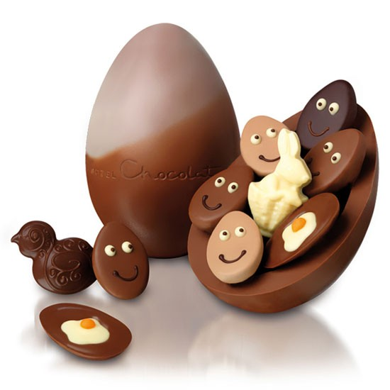

## Directives: the spices of Angualrjs

Let's add more data to our example

```
$scope.todos = {
    mostImportant:'exercise',
    leastImportant:'play video games',
};
$scope.eatingHealthy = false
```

```
<div ng-controller="todoController">
    <div>
    
        <h2>
          I have to: {{todos.mostImportant}}
        </h2>
        
        <p>
          I shouldn't : {{todos.leastImportant}}
        </p>
    </div>
</div>
```


## ngshow directive

Angularjs provides a lot of directives that add functionality to our html

ngShow: show the html element if the value provided is true

```
<div ng-controller="todoController">
    <div>
        <h2>
          I have to: {{todos.mostImportant}}
        </h2>
        
        <p>
          I shouldn't : {{todos.leastImportant}}
        </p>
        
        <p>
        Can I get an easter egg
        covered with chocoalte and filled with peanuts please. 
        I am eating healthy ... hehe.
        
        </p>
    </div>
</div>
```
<!-- .element: class="fragment" -->


## ngHide Directive

```
<div ng-controller="todoController">
    <div>
        <h2>
          I have to: {{todos.mostImportant}}
        </h2>
        
        <p>
          I shouldn't : {{todos.leastImportant}}
        </p>
        
        <p>
        Can I get an easter egg
        covered with chocoalte and filled with peanuts please?!
        </p>
        <p>
        I am eating healthy, no hehe.
        </p>
        
    </div>
</div>
```
<!-- .element: class="fragment" -->


## Todo list

```
app.controller('todoController', function(){
    var todos = [
        "Eat",
        "Run",
        "Run",
        "Exercise",
        "Move",
        "Don't just sit here"
    ];
    $scope.todos = todos;
});
```

Note: Bad way: todo.item[0].name, etc.


## NgRepeat

very important directive.

previous todo application could be rewritten using ngRepeat.

```
<div ng-repeat="item in todo.items">
    <h2>
    List of Todos
    </h2>
    
    <ul>
    
    <li ng-repeat="todo in todos" >
    
    {{todo}}
    
    </li>
    
    </ul>
    
</div>
```
Note: show good way
